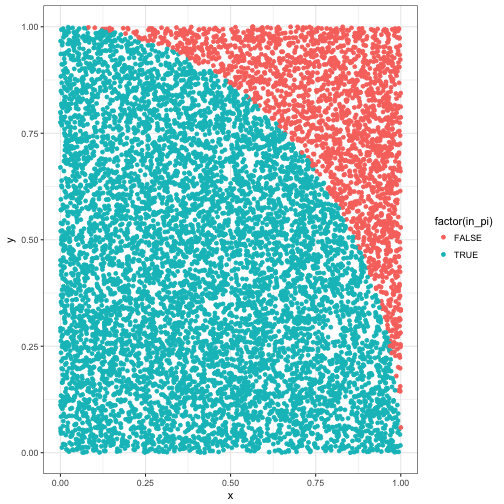
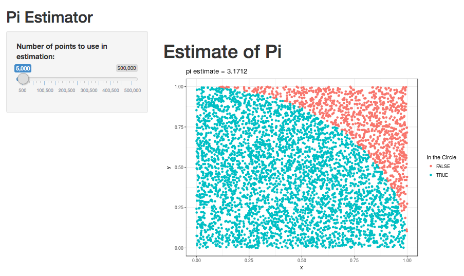

Pi Finder Manual
========================================================
author: Philip Bulsink
date: 2017 March 19
autosize: true

Introduction
========================================================

In recognition of just having passed pi day (March 14: 3-14), I produced a pi calculator using Monte Carlo simulation. It is visible at <https://pbulsink.shinyapps.io/pi_finder/>, and will be explained in the next slides.

### Mathematical Background

You can simulate the value of pi by repeatedly plotting points with randomly selected x and y values, then calculating the distance from that point to the origin (at [0,0]). The distance of that point to the origin is $d = sqrt(x^2+y^2)$. Multiplying the number of points where distance to the origin is one or less by 4 will give you an approximately calculated simulation of pi.

Example
========================================================
A point is plotted on a chart with $x=$ `runif()` and $y=$ 'runif()'.


```r
x <- runif(1); y <- runif(1)
d <- sqrt(x^2 + y^2)
```

In this example, $x=$ 0.876, and $y=$ 0.595, so then $d=$ 1.059.

So, for `n` repeats, where $n = 10 000$:

```r
n <- 10000; x <- runif(n); y <- runif(n)
d <- sqrt(x^2 + y^2)
in_pi <- ifelse(d<=1, TRUE, FALSE)
est_pi <- 4 * sum(in_pi)/n
```

We get an estimate of pi to be 3.1584. Not bad!

Visually
========================================================
Visually, we can see this happening in a plot.
Each point within the 'circle' of radius 1 shows as blue, and every point outside shows red.



Shiny App
========================================================
To use the app, simply change the number of points to use in the calculation and pi will be recalculated and a new plot will be shown.




